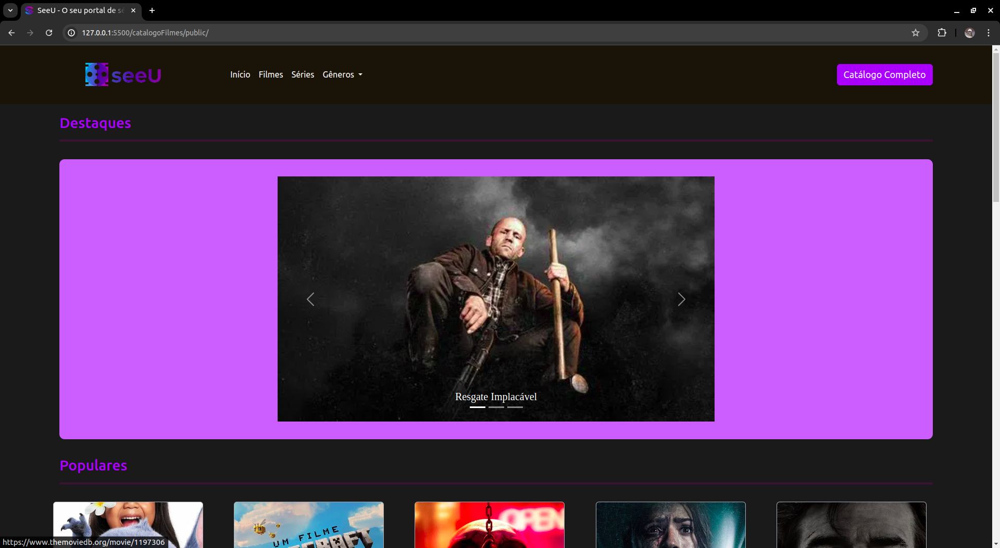
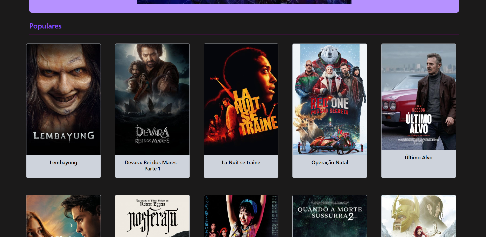
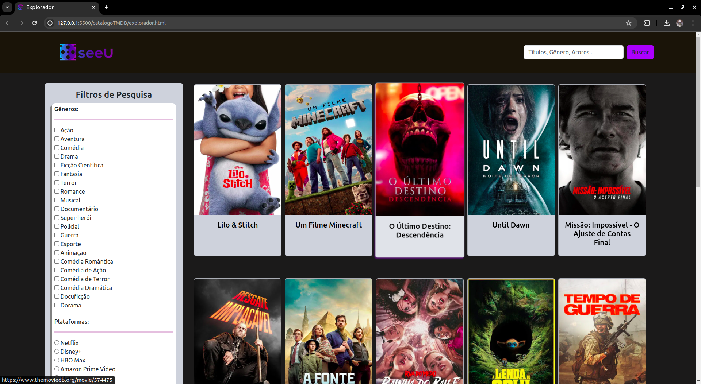

# 🎬 SeeU – Portal de Filmes e Séries

Bem-vindo ao **SeeU**, um portal de filmes e séries que consome dados da API do [The Movie Database (TMDb)](https://www.themoviedb.org/). A aplicação exibe destaques, filmes populares e séries, com redirecionamento direto para a página oficial do conteúdo selecionado.



## 🔥 Destaques

- Interface moderna e responsiva
- Redirecionamento direto para filmes e séries
- Dados dinâmicos consumidos da API do TMDb
- Estilizado com Bootstrap e alertas com SweetAlert

## 🚀 Tecnologias Utilizadas

- HTML5
- CSS3
- JavaScript (Vanilla)
- [Bootstrap](https://getbootstrap.com/)
- [SweetAlert](https://sweetalert2.github.io/)
- [TMDb API](https://www.themoviedb.org/documentation/api)

## 📸 Captura de Tela





## 💻 Como Executar

> O projeto está disponível apenas localmente (ou via repositório GitHub).

### Passos:

1. Clone o repositório:
   ```bash
   git clone https://github.com/JulioFlavio/catalogoFilmes
   ```

2. Abra o arquivo `index.html` (ou `public/index.html`) diretamente no navegador.

3. Navegue pelos filmes e séries com total interatividade!

## ⚠️ Pré-requisitos

- Navegador moderno (como Chrome, Firefox ou Edge)
- Conexão com a internet (para consumo da API)

## 📦 Status do Projeto

✅ Projeto Finalizado  
🔧 Algumas funcionalidades planejadas não foram implementadas

## 👤 Autor

- **Júlio Oliveira**  
[GitHub](https://github.com/JulioFlavio)

---

> ⭐ Se você gostou do projeto, deixe uma estrela no repositório!
